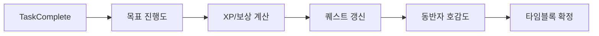

# TimeBlock Planner

> **게이미피케이션과 AI 동반자 시스템을 결합한 지능형 로컬-퍼스트 타임블로킹 플래너**

TimeBlock Planner는 단순한 일정 관리를 넘어, **타임블로킹(Time-blocking)** 방법론을 기반으로 게임화 요소(RPG)와 정서적 지지를 제공하는 **AI 가상 동반자(Waifu Companion)**를 결합하여 깊은 몰입과 생산성을 이끌어내는 데스크톱 애플리케이션입니다.

**로컬-퍼스트(Local-First)** 아키텍처를 채택하여 오프라인에서도 완전한 기능을 제공하며, 백그라운드에서 클라우드와 동기화되어 데이터 안전성을 보장합니다.

---

## ✨ 주요 기능 (Key Features)

### 📅 지능형 타임블로킹 시스템
하루를 3시간 단위의 6개 블록으로 나누어 관리하며, 단순 시간 배분이 아닌 '심리적 저항'을 관리합니다.
- **6-Block System**: 05-08, 08-11, 11-14, 14-17, 17-20, 20-23
- **저항도(Resistance) 기반 스케줄링**:
  - 🟢 **Low (1.0x)**: 즐겁고 가벼운 작업
  - 🟡 **Medium (1.3x)**: 평범한 업무
  - 🔴 **High (1.6x)**: 미루고 싶고 부담되는 작업 (시간 자동 보정)
- **블록 상태**: `Lock`(계획 확정), `Perfect`(시간 내 완수), `Timer`(진행 중), `Failed`(실패)

### 🎮 RPG 게이미피케이션 (Gamification)
생산성 활동을 게임 플레이로 치환하여 지속적인 동기부여를 제공합니다.
- **XP & 레벨링**: 작업의 난이도와 수행 시간에 따른 경험치 획득 (지수 성장 곡선 적용)
- **보스 레이드 (Boss Raid)**: 매일 밤, 하루 동안 완료한 작업량으로 보스 몬스터에게 데미지를 입히는 레이드 시스템
  - **Boss Dex**: 31종의 유니크 보스, 3D 홀로그램 카드 수집 및 실루엣 도감
- **일일 퀘스트**: '오전 블록 모두 성공', '난이도 상 작업 1회 완료' 등 매일 갱신되는 퀘스트
- **상점 & 인벤토리**: 획득한 XP로 생산성 아이템이나 동반자 코스튬/선물 구매

### 🤖 AI 동반자 (Waifu Companion)
단순한 챗봇이 아닌, 사용자의 상태를 인지하고 먼저 말을 거는 상호작용형 파트너입니다.
- **Live2D급 반응성**: 마우스 오버, 클릭, 작업 성공/실패에 따라 실시간으로 반응하는 포즈 시스템
- **감정 시스템**: 호감도(0-100)에 따라 태도가 변화 (적대적 → 무관심 → 친밀 → 애정)
- **특수 상호작용**: 머리 쓰다듬기, 선물하기 등을 통해 해금되는 7가지 시크릿 포즈

### 🧠 Gemini AI & RAG 통합
Google의 Gemini Pro 모델과 RAG(검색 증강 생성) 기술을 결합하여 내 데이터를 기억하는 AI 비서입니다.
- **하이브리드 RAG (Retrieval-Augmented Generation)**:
  - **Direct Query**: "지난주 화요일에 뭐 했어?" → IndexedDB 정밀 검색 (100% 정확도)
  - **Vector Search**: "최근에 코딩 관련해서 힘들어했던 게 뭐야?" → Orama 벡터 검색 (의미론적 추론)
- **컨텍스트 인식**: 현재 수행 중인 작업, 최근 실패율, 사용자의 기분 상태를 파악하여 조언
- **기능적 AI**:
  - **작업 분해**: 복잡한 작업을 실행 가능한 단위로 자동 분할
  - **자동 태깅**: 과거 패턴을 분석하여 적절한 태그 추천

### 🌩️ 3-Tier 데이터 동기화
데이터 유실을 원천 차단하는 강력한 동기화 아키텍처를 자랑합니다.
1.  **Local (IndexedDB/Dexie)**: 모든 데이터는 로컬에 우선 저장 (오프라인 완벽 지원)
2.  **Cloud (Firebase RTDB)**: 백그라운드에서 실시간 백업 및 다중 기기 동기화
3.  **Conflict Resolution**: Last-Write-Wins 알고리즘과 해시 비교를 통한 데이터 무결성 보장

---

## 🛠 기술 스택 (Tech Stack)

### Core
-   **Runtime**: Electron 39.2.1
-   **Framework**: React 19.2.1
-   **Language**: TypeScript 5.5+
-   **Build Tool**: Vite 7.2.2

### State & Data
-   **State Management**: Zustand 5.0.8
-   **Local Database**: Dexie.js 4.0 (IndexedDB Wrapper)
-   **Search Engine**: Orama 3.1 (In-memory Vector Search)
-   **Cloud Database**: Firebase Realtime Database
-   **Serverless**: Firebase Cloud Functions

### UI/UX
-   **Styling**: Tailwind CSS 3.4
-   **Animation**: Framer Motion 12, Canvas Confetti
-   **Icons**: Lucide React
-   **Charts**: Recharts 2.13

---

## 🏗 아키텍처 하이라이트

### 1. Handler Pattern (작업 완료 파이프라인)
작업 완료 시 발생하는 복잡한 사이드 이펙트를 단일 책임 원칙(SRP)에 따라 분리된 핸들러 체인으로 처리합니다.



### 2. Repository Pattern
UI 컴포넌트는 절대 데이터베이스나 Firebase에 직접 접근하지 않습니다. 모든 데이터 접근은 `Repository` 계층을 통해 이루어지며, 이 계층이 로컬 DB와 원격 동기화를 조율합니다.

### 3. Google Calendar & Tasks 양방향 동기화 (v17)
- **Tasks**: 앱 내 '주요 작업' ↔ Google Tasks 양방향 동기화
- **Events**: 앱 내 '임시 스케줄' ↔ Google Calendar 이벤트 양방향 동기화
- 별도의 매핑 테이블(`taskGoogleTaskMappings`, `tempScheduleCalendarMappings`)을 통해 ID 매칭 및 변경 사항 추적

---

## 🗄 데이터베이스 스키마 (Dexie v17)

프로젝트는 지속적으로 발전하며 총 17번의 스키마 마이그레이션을 거쳤습니다.

| 테이블 | 설명 | 비고 |
| :--- | :--- | :--- |
| **dailyData** | 날짜별 작업, 타임블록 데이터의 핵심 저장소 | `date` (PK) |
| **gameState** | 레벨, XP, 보스전 진행도 등 게임 상태 | Singleton |
| **globalInbox** | 날짜가 지정되지 않은 작업 (인박스) | |
| **completedInbox** | 완료된 인박스 작업 아카이브 | v7+ |
| **templates** | 반복 사용되는 작업 및 루틴 템플릿 | |
| **waifuState** | 동반자 호감도, 해금된 포즈, 상호작용 기록 | |
| **chatHistory** | Gemini AI와의 대화 로그 | RAG 소스로 활용 |
| **ragDocuments** | 검색 효율화를 위한 벡터 임베딩 저장소 | v12+ |
| **systemState** | 앱 설정 및 로컬 전용 상태 (localStorage 대체) | v6+ |
| **weeklyGoals** | 주간 목표 및 성과 추적 | v14+ |
| **taskGoogleTaskMappings** | Google Tasks 연동을 위한 ID 매핑 | v17+ |
| **tempScheduleTasks** | 타임블록에 할당되기 전의 임시 일정 | v15+ |

---

## 🚀 시작하기 (Getting Started)

### 사전 요구사항
- Node.js 18 이상
- npm

### 설치 및 실행

```bash
# 1. 저장소 클론
git clone https://github.com/winston365/timeblock_new.git
cd timeblock_new

# 2. 의존성 설치
npm install

# 3. 개발 모드 실행 (Electron + React HMR)
npm run electron:dev

# (선택) 웹 전용 개발 모드
npm run dev
```

### 빌드 및 배포

```bash
# 현재 OS에 맞는 인스톨러 생성
npm run dist

# 특정 플랫폼 빌드
npm run dist:win   # Windows (.exe)
npm run dist:mac   # macOS (.dmg)
```

## 🧪 테스트 및 품질 관리

```bash
# 전체 테스트 실행 (Vitest)
npm test

# 커버리지 리포트 생성
npm run test:coverage

# 린트 검사
npm run lint
```

---

## 📁 프로젝트 구조

```
src/
├── app/                 # 앱 진입점 및 초기화 로직 (AppShell)
├── data/                # 데이터 계층
│   ├── db/              # Dexie 스키마 정의 및 마이그레이션
│   └── repositories/    # 데이터 접근 객체 (DAO)
├── features/            # 기능별 모듈 (Feature-First Architecture)
│   ├── schedule/        # 타임블로킹 메인 UI
│   ├── waifu/           # 동반자 시스템 로직 및 에셋
│   ├── gemini/          # AI 채팅 및 RAG
│   ├── gamification/    # 게임 로직 (보스, 상점 등)
│   └── ...
├── shared/              # 공용 모듈
│   ├── lib/             # EventBus, 외부 라이브러리 래퍼
│   ├── services/        # 비즈니스 로직 (Sync, TaskCompletion 등)
│   ├── stores/          # Zustand 스토어
│   └── types/           # 전역 타입 정의
└── styles/              # Tailwind 설정 및 글로벌 스타일
```

---

**Made with ❤️ by winston365**
*Private Project - All Rights Reserved*
