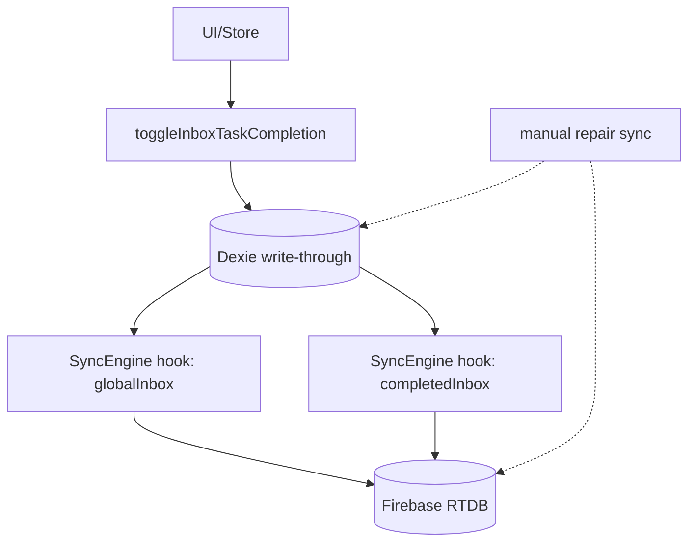

# 데이터 최적화 타겟 아키텍처 설계

> Date: 2026-01-10
> Scope: DI-3 / DI-2 / DI-1 (Inbox & CompletedInbox 중심)

## Changelog
| Date | Handoff | Request | Summary |
| --- | --- | --- | --- |
| 2026-01-10 | User → Architect | DI-1~3 타겟 아키텍처 설계 | 코드 기반 AS-IS 확정 후, 증분 동기화/dirty tracking/단일 sync 트리거 중심 TO-BE 설계 정리 |

---

## 1. 설계 원칙

- **단일 동기화 트리거(Single Source of Sync Truth)**
  - Repo는 Dexie에만 쓰고, Firebase 동기화는 SyncEngine(또는 syncCore) 단일 경로로 수행한다.
  - 예외는 “초기 부트스트랩/복구(repair)” 같은 명시적 경로로만 둔다.

- **증분 처리 우선(O(Δ))**
  - 변경 1건은 로컬/원격 모두 “변경 1건”으로 적용한다.
  - 전체 스캔, clear→bulkPut, 전체 재업로드는 최후 수단(장애 복구/마이그레이션)으로 격리한다.

- **비동기·백그라운드 처리 + 재시도**
  - UI 경로는 빠른 Dexie write-through로 끝낸다.
  - 네트워크 작업은 debouncer + retryQueue로 백그라운드 처리한다.

- **충돌 해결은 ‘아이템 단위’로 설계한다**
  - 날짜별 배열(date-keyed array) 기반은 구조적으로 “동일 날짜의 동시 변경”에 취약하다(마지막 쓰기 승리로 전체 덮어쓰기).
  - 타겟은 itemSync 패턴(아이템 단위 path)으로 충돌 영역을 최소화한다.

- **멀티 윈도우/멀티 디바이스 정합성은 ‘에코 방지 + 직렬화’로**
  - deviceId 기반 에코 방지(readDeviceId).
  - operationQueue + isSyncingFromRemote로 remote-apply 동안 hook 재발화(loop)를 차단한다.

---

## 2. DI-3: 인박스 이중 동기화 해결

### 현재 상태 (AS-IS)

근거 코드:
- src/data/repositories/inboxRepository.ts: toggleInboxTaskCompletion()이 Dexie write 후 withFirebaseSync(syncBothInboxTablesToFirebase) 실행
- src/data/db/infra/syncEngine/index.ts: globalInbox는 item-level hook, completedInbox는 debounce+전체 스캔 hook

#### 코드 흐름 다이어그램 (AS-IS)

```mermaid
flowchart TD
  UI[UI/Store] -->|toggleAnyTaskCompletion| Repo[toggleInboxTaskCompletion]

  Repo -->|db.completedInbox.put + db.globalInbox.delete| Dexie[(Dexie)]
  Repo -->|withFirebaseSync(syncBothInboxTablesToFirebase)| ManualFullSync[syncBothInboxTablesToFirebase]

  Dexie -->|hook: globalInbox item-level| HookGlobal[SyncEngine: globalInbox hook]
  Dexie -->|hook: completedInbox debounce| HookCompleted[SyncEngine: completedInbox hook]

  ManualFullSync -->|db.globalInbox.toArray + db.completedInbox.toArray| Dexie
  ManualFullSync -->|syncToFirebase globalInbox + completedInbox(date-keyed)| Firebase[(Firebase RTDB)]

  HookGlobal -->|syncItem/deleteItem| Firebase
  HookCompleted -->|toArray → groupByDate → syncToFirebase per date| Firebase

  %% 결과: 동일 변경에 대해 (1) hook 기반 sync + (2) manual full sync가 중복 발생
```

### 목표 상태 (TO-BE)

- toggle 경로에서는 **명시적 전체 동기화 호출을 제거**하고, SyncEngine hook(또는 itemSync) 단일 경로로만 Firebase write가 발생한다.
- “전체 재동기화”는 진단/복구 목적의 별도 유틸로만 남긴다(사용자 액션 경로에서 호출 금지).

#### 새로운 코드 흐름 (TO-BE)



### 구현 전략

- src/data/repositories/inboxRepository.ts
  - `toggleInboxTaskCompletion()`에서 `withFirebaseSync(syncBothInboxTablesToFirebase, ...)` 호출을 제거한다.
  - `syncBothInboxTablesToFirebase()`는 남기되, 호출자를 “복구/마이그레이션/관리자 버튼”처럼 의도된 경로로 제한한다.

- Sync 정책 가드(권장)
  - “hook이 이미 걸린 테이블”에 대해서 repository가 다시 `syncToFirebase()`를 호출하지 못하게 하는 정책(가드 함수/린트 규칙)을 둔다.

### 예상 코드 변경 (의사코드 수준)

```ts
// inboxRepository.ts
export async function toggleInboxTaskCompletion(taskId: string): Promise<Task> {
  const task = await findTaskInGlobalOrCompleted(taskId);
  const next = { ...task, completed: !task.completed, completedAt: nextCompletedAt(task) };

  await moveBetweenTables(next); // db.completedInbox.put/delete + db.globalInbox.put/delete

  // TO-BE: 여기서 Firebase sync를 직접 호출하지 않음
  // SyncEngine hooks가 firebase write를 담당

  return next;
}

// (옵션) Repair 경로
export async function repairSyncInboxToFirebase(): Promise<void> {
  // 명시적 호출만 허용 (diagnose tool / 메뉴)
  await syncBothInboxTablesToFirebase();
}
```

---

## 3. DI-2: RTDB→Dexie CompletedInbox 전체 재작성 문제를 증분 적용으로 전환

### 현재 상태 (AS-IS)

- Firebase 구조: `users/{uid}/completedInbox/{dateKey}` → Task[] (date-keyed array)
- RTDB 리스너: 날짜 key-range로 child 이벤트 수신
- 로컬(Dexie) 구조: `db.completedInbox`는 task id 기반 테이블
- 현재 구현: date 한 건 변경에도 `completedInboxByDate` 전체를 union한 뒤 `db.completedInbox.clear()` → `bulkPut(all)`

```mermaid
flowchart TD
  RTDB[RTDB child event on completedInbox/dateKey] --> Cache[completedInboxByDate Map]
  Cache --> Apply[applyRemoteUpdate]
  Apply -->|union all dates| Union[Map taskId -> Task]
  Union -->|clear| DexieClear[db.completedInbox.clear]
  Union -->|bulkPut| DexiePut[db.completedInbox.bulkPut(all)]

  %% 문제: O(n) 재작성 + clear/bulkPut 사이 플리킹 + 충돌 시 로컬 변경 손실 위험
```

### 목표 상태 (TO-BE)

- “변경된 dateKey만” 로컬에 증분 반영한다.
- clear→bulkPut을 제거하고, **bulkPut/bulkDelete(또는 transaction)** 로 최소 변경만 적용한다.
- 장기적으로는 date-keyed array 자체를 제거하고 **itemSync path(아이템 단위)** 로 전환한다.

#### 단계적 TO-BE

- Step 1(호환 유지): date-keyed array는 유지하되 **date 단위 diff 적용**
- Step 2(이상적 종착점): CompletedInbox를 itemSync 스키마로 마이그레이션

### 구현 전략

#### 3.1 incremental upsert 방식(호환 유지)

핵심 아이디어:
- RTDB 이벤트는 특정 dateKey만 바뀐다.
- 따라서 “그 dateKey에 속한 Task 집합”의 diff만 계산해 Dexie에 반영한다.

필요한 준비:
- Dexie completedInbox 레코드에 `completedDateKey`를 저장/인덱싱(권장)
  - 삭제 시: `where('completedDateKey').equals(dateKey).delete()`로 O(k) 삭제
  - 업데이트 시: 해당 dateKey의 task만 bulkPut
- 스키마 변경이 부담이면(즉시 불가) 임시로 `completedInboxDateIndex` 같은 보조 테이블을 둔다.

#### 3.2 삭제 감지 및 처리

- `child_removed`(dateKey): 그 dateKey에 속한 로컬 task를 전부 삭제
- payload가 `null`: 동일하게 처리

#### 3.3 충돌 해결 전략

- 현재 스키마(date-keyed array)는 “동일 dateKey에서 동시 업데이트”에 취약하다.
  - 단기(호환 유지)에서는 최소한 local pending write를 보호한다:
    - operationQueue 직렬화 유지
    - applyRemoteUpdate 동안 isSyncingFromRemote로 hook 업로드 차단
    - 로컬이 더 최신이면(예: task.updatedAt 비교) remote overwrite를 무시하거나 병합
- 장기(이상적)에서는 itemSync로 충돌 영역을 taskId 단위로 축소한다.

### 예상 코드 변경

#### 3.1 date 단위 diff 적용(호환 유지) 의사코드

```ts
// listener.ts (completedInbox date-keyed handler)
// completedInboxByDate: Map<dateKey, Task[]>

onCompletedInboxDateChanged(dateKey, nextTasksOrNull) {
  const prevTasks = completedInboxByDate.get(dateKey) ?? [];
  const nextTasks = nextTasksOrNull ?? [];
  completedInboxByDate.set(dateKey, nextTasks);

  void applyRemoteUpdate(async () => {
    // 1) removed ids
    const prevIds = new Set(prevTasks.map(t => t.id));
    const nextIds = new Set(nextTasks.map(t => t.id));
    const removedIds = [...prevIds].filter(id => !nextIds.has(id));

    // 2) delete removed
    if (removedIds.length > 0) {
      await db.completedInbox.bulkDelete(removedIds);
    }

    // 3) upsert next tasks (with completedDateKey normalized)
    const upserts = nextTasks.map(t => ({ ...t, completedDateKey: dateKey }));
    if (upserts.length > 0) {
      await db.completedInbox.bulkPut(upserts as never[]);
    }

    // 4) (optional) if dateKey removed entirely, delete-by-index faster
    // await db.completedInbox.where('completedDateKey').equals(dateKey).delete();
  }, `completedInbox:${dateKey}`);
}
```

#### 3.2 이상적 종착점: itemSync 스키마

- Firebase path(제안):
  - `users/{uid}/completedInboxItems/data/{taskId}` → SyncData<Task & { completedDateKey }>
- 장점:
  - RTDB 이벤트 1건 = task 1건
  - 충돌 영역 최소화(동일 날짜라도 서로 다른 taskId는 독립)
  - 로컬 apply가 자연스럽게 bulkPut/bulkDelete로 수렴

---

## 4. DI-1: CompletedInbox Hook 전체 스캔 제거(스마트 캐싱/dirty tracking)

### 현재 상태 (AS-IS)

- Dexie hook(creating/updating/deleting) 발생 시마다 debounce 후:
  - `db.completedInbox.toArray()` 전체 스캔
  - `groupCompletedByDate()`로 날짜별 그룹화
  - date별 `syncToFirebase(completedInboxStrategy, tasks, date)` 호출

### 목표 상태 (TO-BE)

- 변경된 task로부터 **영향받는 dateKey만** dirty로 표시한다.
- debounce도 `completedInbox:${dateKey}` 단위로 분할한다.
- sync 시 해당 dateKey의 task만 Dexie에서 조회(또는 캐시)하여 업로드한다.

### 구현 전략

- Dirty set: `Set<dateKey>`
- Hook에서 dateKey 추출:
  - create/update: obj.completedAt 기반으로 dateKey 결정
  - delete: obj.completedAt 기반으로 dateKey 결정(삭제 hook에 obj 제공됨)
- Debounce 단위:
  - 기존: `completedInbox:all`
  - 변경: `completedInbox:${dateKey}`

캐시 무효화:
- local hook 발생 시 해당 dateKey dirty
- remote apply 동안 isSyncingFromRemote로 hook 실행 차단(이미 존재)
- sync 성공 시 dirty 해제, 실패 시 retryQueue로 재시도

### 예상 코드 변경

```ts
// syncEngine/index.ts
registerHooks(db.completedInbox, async (_id, task, op) => {
  const dateKey = toCompletedDateKey(task); // completedAt -> YYYY-MM-DD
  markDirty(dateKey);

  debouncer.schedule(`completedInbox:${dateKey}`, 750, async () => {
    // date 단위 조회 (index 권장)
    const tasksForDate = await queryCompletedInboxByDate(dateKey);

    // 빈 배열이면 remote에서 해당 dateKey를 삭제(null)로 표현
    await syncToFirebase(completedInboxStrategy, tasksForDate, dateKey);

    clearDirty(dateKey);
  });
});
```

---

## 5. 전체 데이터 흐름도 (TO-BE)

```mermaid
flowchart LR
  UI[UI/Stores] --> Repo[Repositories]
  Repo --> Dexie[(Dexie IndexedDB)]

  subgraph SyncEngine[SyncEngine]
    Hooks[Dexie Hooks]
    Debouncer[Debouncer (per-key)]
    OpQ[OperationQueue + isSyncingFromRemote]
  end

  Dexie --> Hooks --> Debouncer --> Firebase[(Firebase RTDB)]
  Firebase --> RTDBListeners[RTDB Listeners (leader-only)] --> OpQ --> Dexie

  %% 핵심: UI는 Firebase를 직접 건드리지 않음
```

핵심 변화 요약:
- UI/Repo 경로에서 “전체 sync 호출” 제거
- CompletedInbox는 (1) 로컬 dirty-date 기반 업로드, (2) 원격은 date 단위 diff 적용 또는 itemSync로 전환

---

## 6. 마이그레이션 전략

### 기존 데이터와의 호환성

- 단기(호환 유지): Firebase의 `completedInbox/{dateKey}`(배열) 형태는 유지한다.
- 장기(타겟): `completedInboxItems/data/{taskId}`(아이템) 형태를 병행(dual-write) 후 이전한다.

### 점진적 롤아웃 방안

1) Phase 0 (DI-3)
- toggle 경로에서 manual full sync 제거
- 성능/로그로 “중복 sync 제거”를 검증

2) Phase 1 (DI-2)
- RTDB CompletedInbox 리스너에서 clear→bulkPut 제거
- dateKey 단위 diff 적용으로 Dexie를 증분 반영

3) Phase 2 (DI-1)
- SyncEngine completedInbox hook을 dirty-date 기반으로 변경

4) Phase 3 (이상적 종착점)
- completedInbox를 itemSync 스키마로 dual-write
- 리스너는 신규 경로 우선 read, 없으면 레거시 date-keyed read fallback

### 롤백 계획

- 각 Phase는 feature flag로 감싸고, 문제가 생기면 즉시 기존 방식으로 되돌린다.
  - DI-3: manual sync 호출 복구(최후 수단)
  - DI-2: clear→bulkPut 복구(최후 수단)
  - DI-1: completedInbox:all 전체 스캔 sync 복구(최후 수단)

---

## 7. 리스크 및 완화 방안

- 리스크: date-keyed array 구조 자체의 충돌(동일 날짜 동시 변경)
  - 완화: 단기에는 local 최신 보호(최신성 비교), 장기에는 itemSync로 전환

- 리스크: delete 처리 누락으로 유령 task 잔존
  - 완화: dateKey 기반 delete-by-index(권장), 계약 테스트로 보장

- 리스크: remote apply 중 hook 재발화(loop)로 업로드 폭증
  - 완화: isSyncingFromRemote 가드 유지 + operationQueue를 통한 remote apply 표준화

- 리스크: 멀티 윈도우에서 upload가 중복 발생
  - 완화: (권장) leader-only 업로드 게이트 도입 또는 hash cache 스코프 검증/강화

### 테스트 전략

- 단위 테스트
  - “date diff 적용”에서 removedIds/upserts가 정확히 Dexie에 반영되는지
  - dirty-date 스케줄링이 dateKey 단위로만 동작하는지

- 통합/시나리오 테스트
  - toggle 1회에 대해 Firebase write가 1회 경로로만 발생(중복 호출 제거)
  - remote date 변경 1건이 Dexie clear 없이 증분 반영되는지
  - 멀티 디바이스(에코 방지)에서 자기 deviceId 이벤트를 무시하는지
