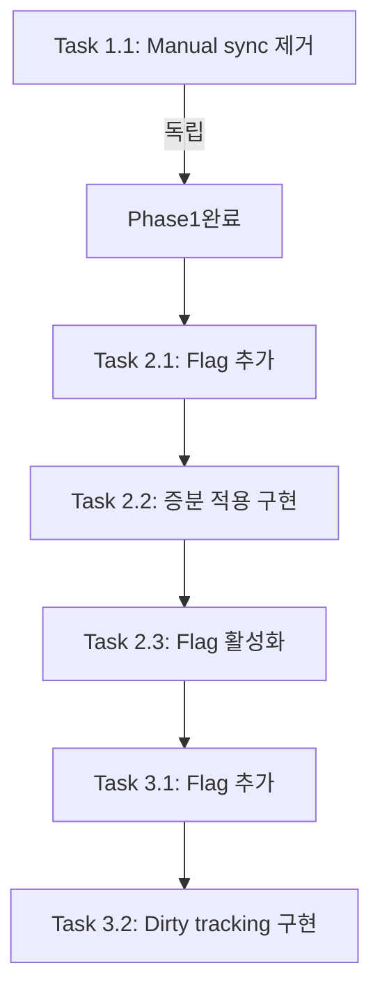

# 병목 지점 비판적 검토 보고서

## Changelog
| Date | Handoff | Request | Summary |
| --- | --- | --- | --- |
| 2026-01-10 | User → Critic | 데이터 인프라 진단 결과 검토 | 초기 비판적 검토 완료, 우선순위 재설정 |
| 2026-01-10 | User → Critic | 구현 계획 검토 | Task별 코드 검증 및 리스크 평가, 7. 구현 계획 검토 섹션 추가 |

---

## 1. 검토 총평

### 전반적인 진단의 정확성 평가

Analyst의 진단은 **전반적으로 정확하며 코드 증거에 기반**하고 있음. 각 이슈의 코드 위치와 동작 패턴이 정확히 식별되었고, 병목 메커니즘에 대한 분석이 타당함.

**진단의 강점:**
- 코드 라인 단위 증거 확보가 잘 됨
- Dexie hook → Firebase sync 흐름을 정확히 추적함
- 시간 복잡도(O(n)) 분석이 적절함

**진단의 약점:**
- 모든 이슈가 **"중간" 심각도**로 평가되어 우선순위 구분이 부족함
- **실제 런타임 영향도** 정량화가 없음 (사용자 규모, 데이터량 추정치 부재)
- 일부 이슈의 **실제 발생 빈도**가 과장되었을 가능성 있음

### 누락된 중요 이슈

| # | 누락된 이슈 | 중요도 | 설명 |
|---|---|---|---|
| 1 | **Hash Cache 효과성** | 낮음 | `syncToFirebase`는 이미 해시 캐시로 중복 업로드 방지 → DI-1, DI-3의 실제 Firebase 쓰기 비용이 분석보다 낮을 수 있음 |
| 2 | **Debounce 효과** | 낮음 | DI-1은 750ms debounce가 있어 연속 변경 시 배치 처리됨 → 실제 스캔 횟수가 예상보다 적을 수 있음 |
| 3 | **Leader Lock 보호** | 정보 | RTDB 리스너가 leader window에서만 동작해 다중 창 시나리오의 플리킹 위험이 제한됨 |

---

## 2. 이슈별 재평가

### DI-1: CompletedInbox Hook 전체 스캔

**코드 확인 결과:**
```typescript
// src/data/db/infra/syncEngine/index.ts#L143-L158
this.registerHooks(db.completedInbox, async () => {
  this.debouncer.schedule('completedInbox:all', 750, async () => {
    const completedTasks = await db.completedInbox.toArray();  // O(n) 전체 스캔
    const grouped = groupCompletedByDate(completedTasks);      // O(n) 그룹화
    // 각 날짜별로 syncToFirebase 호출
    await Promise.all(syncPromises);
  });
});
```

- **실제 영향도: 중간-낮음**
  - 750ms debounce로 연속 변경이 배치됨
  - Hash cache가 동일 데이터 재전송 방지
  - 하지만 대량 완료 작업(수백 건+)에서는 스캔 비용이 체감됨

- **비즈니스 임팩트:**
  - 사용자 경험: **낮음** (백그라운드 작업, UI 블로킹 없음)
  - 시스템 안정성: **낮음** (debounce로 안정화됨)
  - Firebase 비용: **중간** (날짜별 다중 set, 해시 캐시로 완화)

- **수정 난이도: 중간**
  - 변경된 날짜만 추적하는 dirty tracking 필요
  - 기존 hook 구조 유지하면서 개선 가능
  - 예상 작업 시간: 4-6시간

- **최종 우선순위: P2**
- **근거:** Debounce와 hash cache로 실제 영향이 완화됨. 개선 시 효과는 있으나 급하지 않음.

---

### DI-2: RTDB→Dexie 전체 재작성

**코드 확인 결과:**
```typescript
// src/data/db/infra/syncEngine/listener.ts#L276-L296
void applyRemoteUpdate(async () => {
  const map = new Map<string, Task>();
  for (const tasks of completedInboxByDate.values()) {
    for (const task of tasks) {
      map.set(task.id, task);  // O(n) 맵 재구성
    }
  }
  const mergedTasks = Array.from(map.values());
  await db.completedInbox.clear();  // 전체 삭제
  if (mergedTasks.length > 0) {
    await db.completedInbox.bulkPut(mergedTasks as never[]);  // 전체 재삽입
  }
}, 'completedInbox:all');
```

- **실제 영향도: 중간**
  - **심각한 설계 결함**: 원격 1건 변경 → 로컬 전체 O(n) 재작성
  - `operationQueue` 직렬화로 동시성 문제는 방지됨
  - Leader lock으로 다중 창 플리킹은 제한됨
  - 하지만 **clear→bulkPut 사이 순간적 데이터 부재** 가능

- **비즈니스 임팩트:**
  - 사용자 경험: **중간** (대량 데이터 시 순간적 UI 깜빡임 가능)
  - 시스템 안정성: **중간** (clear와 bulkPut 사이 race condition 잠재)
  - Firebase 비용: **없음** (읽기만 발생, 쓰기 비용 무관)

- **수정 난이도: 높음**
  - date-keyed 구조의 근본적 재설계 필요
  - ID 기반 개별 upsert/delete로 전환 시 리스너 로직 대폭 변경
  - 예상 작업 시간: 8-12시간

- **최종 우선순위: P1**
- **근거:** 데이터 정합성에 영향을 줄 수 있는 설계 결함. 비용 문제보다 안정성 문제가 더 중요.

---

### DI-3: 인박스 완료 토글 전량 업로드

**코드 확인 결과:**
```typescript
// src/data/repositories/inboxRepository.ts#L281-L295
if (task.completed) {
  await db.completedInbox.put(task);    // 단일 put
  await db.globalInbox.delete(taskId);  // 단일 delete
} else {
  await db.globalInbox.put(task);
  await db.completedInbox.delete(taskId);
}
// Firebase 동기화
withFirebaseSync(syncBothInboxTablesToFirebase, 'GlobalInbox:toggle');
```

```typescript
// syncBothInboxTablesToFirebase()
const [activeTasks, completedTasks] = await Promise.all([
  db.globalInbox.toArray(),        // 전체 스캔 1
  db.completedInbox.toArray()      // 전체 스캔 2
]);
// 두 테이블 전체를 Firebase로 동기화
```

- **실제 영향도: 높음 (분석 대비 과소평가됨)**
  - **SyncEngine hook이 이미 item-level sync를 수행**하는데, 별도로 전량 업로드를 추가 호출
  - 동일한 변경에 대해 **이중 동기화** 발생 가능:
    1. `db.completedInbox.put(task)` → SyncEngine hook → 전체 스캔 sync
    2. `syncBothInboxTablesToFirebase()` → 또 전체 스캔 sync
  - 해시 캐시가 중복 방지하지만, 스캔 자체는 2번씩 발생

- **비즈니스 임팩트:**
  - 사용자 경험: **낮음** (비동기 처리)
  - 시스템 안정성: **낮음**
  - Firebase 비용: **중간-높음** (토글 빈도에 비례, 해시 캐시로 완화)

- **수정 난이도: 낮음**
  - `syncBothInboxTablesToFirebase()` 호출 제거 → SyncEngine hook에 위임
  - 또는 item-level sync 전환
  - 예상 작업 시간: 2-4시간

- **최종 우선순위: P1**
- **근거:** 수정 난이도가 낮으면서 명확한 이중 작업 제거 효과. ROI가 높음.

---

### DI-4: saveCollection 전체 재동기화

**코드 확인 결과:**
```typescript
// src/data/repositories/baseRepository.ts#L327-L343
export async function saveCollection<T>(...) {
  // 1. IndexedDB에 저장 (전체 교체)
  await table.clear();
  if (items.length > 0) {
    await table.bulkPut(items as never);
  }
  // 3. Firebase에 저장
  if (syncFirebase && firebaseStrategy && isFirebaseInitialized()) {
    syncToFirebase(firebaseStrategy, items, 'all').catch(...);
  }
}
```

**호출 경로 조사:**
- `tempScheduleRepository.ts#L377-L380`: temp 스케줄 저장
- `weeklyGoalRepository.ts#L142`: Firebase 데이터 로드 시
- 일부 리포지토리의 batch 저장

- **실제 영향도: 낮음-중간**
  - 대부분의 주요 저장(dailyData, inbox, tasks)은 saveCollection을 사용하지 않음
  - templates, shopItems 등 **저빈도 변경 데이터**에 주로 사용
  - clear→bulkPut 패턴은 Dexie 공식 권장 패턴이기도 함

- **비즈니스 임팩트:**
  - 사용자 경험: **낮음** (저빈도 호출)
  - 시스템 안정성: **낮음**
  - Firebase 비용: **낮음** (호출 빈도가 낮음)

- **수정 난이도: 중간**
  - 부분 업데이트(diff 적용) 로직 추가 필요
  - 기존 호출자들의 기대 동작 변경 위험
  - 예상 작업 시간: 6-8시간

- **최종 우선순위: P3**
- **근거:** 실제 호출 빈도가 낮아 비용 영향이 미미함. 이론적으로는 비효율적이나 실무 영향도가 낮음.

---

### DI-5: 날짜 탐색 시 반복 get()

**코드 확인 결과:**
```typescript
// src/shared/constants/defaults.ts#L97
rtdbDateKeyedLookbackDays: 3,

// src/data/db/infra/syncEngine/listener.ts#L59
cutoff.setDate(cutoff.getDate() - FIREBASE_SYNC_DEFAULTS.rtdbDateKeyedLookbackDays);
const startAtDateKey = getLocalDate(cutoff);

// src/shared/services/sync/firebase/rtdbBackfill.ts - backfillKeyOnce
// 이미 in-flight 캐시로 중복 요청 방지
const existing = inFlight.get(cacheKey) as Promise<T | null> | undefined;
if (existing) {
  return existing;  // 캐시 적중
}
```

- **실제 영향도: 낮음**
  - `backfillKeyOnce`가 이미 **in-flight 캐시**로 동일 키 중복 fetch 방지
  - 한 번 fetch된 데이터는 Dexie에 저장되어 재요청 불필요
  - lookback=3일은 **의도적 대역폭 최적화** 결정임

- **비즈니스 임팩트:**
  - 사용자 경험: **낮음** (네트워크 지연이 있으나 캐시로 완화)
  - 시스템 안정성: **낮음**
  - Firebase 비용: **낮음** (읽기 비용, 캐시로 최소화)

- **수정 난이도: 중간**
  - lookback 확장 시 초기 리스너 대역폭 증가
  - prefetch 전략 추가 시 복잡도 증가
  - 예상 작업 시간: 4-6시간

- **최종 우선순위: P3**
- **근거:** 현재 설계가 의도적 트레이드오프이며, 캐시로 실제 영향이 최소화됨. 개선 효과 대비 비용이 높음.

---

## 3. 우선순위 요약 테이블

| 이슈 ID | 제목 | 우선순위 | 비즈니스 임팩트 | 수정 난이도 | ROI |
|---------|------|----------|-----------------|-------------|-----|
| **DI-3** | 인박스 완료 토글 전량 업로드 | **P1** | 중간 (Firebase 비용) | **낮음** | **높음** |
| **DI-2** | RTDB→Dexie 전체 재작성 | **P1** | 중간 (안정성) | 높음 | 중간 |
| DI-1 | CompletedInbox Hook 전체 스캔 | P2 | 낮음 | 중간 | 중간 |
| DI-4 | saveCollection 전체 재동기화 | P3 | 낮음 | 중간 | 낮음 |
| DI-5 | 날짜 탐색 시 반복 get() | P3 | 낮음 | 중간 | 낮음 |

---

## 4. 권장 개선 순서

### Phase 1: Quick Wins (1-2일)
**DI-3 먼저 수정** - 가장 높은 ROI
- `toggleInboxTaskCompletion`에서 `syncBothInboxTablesToFirebase()` 호출 제거
- SyncEngine의 기존 hook이 item-level sync를 담당하도록 위임
- 이중 동기화 제거로 즉각적인 비용 절감

### Phase 2: 안정성 개선 (1주)
**DI-2 수정** - 데이터 정합성 보장
- `clear()→bulkPut()` 대신 ID 기반 incremental upsert/delete로 전환
- 원격 변경 1건 → 로컬 1건 변경으로 비례 관계 확립
- 테스트 커버리지 확보 필수

### Phase 3: 최적화 (선택적)
**DI-1 수정** - 있으면 좋지만 급하지 않음
- dirty date tracking 도입
- 변경된 날짜만 선택적 sync
- Debounce가 이미 상당 부분 완화 중

### 연기 권장
**DI-4, DI-5** - 실제 영향도가 낮음
- 호출 빈도가 낮거나 캐시로 이미 완화됨
- 리소스 여유 있을 때 개선 고려

---

## 5. 비판적 의견

### 과장된 부분
1. **"모든 이슈가 중간 심각도"** - 실제로는 DI-3, DI-2만 유의미한 개선 효과
2. **Firebase 비용 우려** - Hash cache가 중복 업로드를 상당 부분 방지함
3. **DI-5의 "누적 네트워크 왕복"** - in-flight 캐시와 Dexie 캐시로 실제 영향 미미

### 진단에서 놓친 긍정적 요소
1. **Debounce 750ms** - 연속 변경 배치 처리로 실제 스캔 횟수 감소
2. **Leader lock** - 다중 창 경합 방지로 플리킹 위험 제한
3. **OperationQueue 직렬화** - 원격 업데이트 순차 처리로 race condition 방지

### 리스크 평가
| 수정 대상 | 회귀 리스크 | 근거 |
|-----------|-------------|------|
| DI-3 | **낮음** | 기존 hook이 이미 동작 중, 중복 호출 제거만 |
| DI-2 | **중간** | 데이터 머지 로직 변경, 충돌 해결 테스트 필요 |
| DI-1 | **낮음** | 기존 동작 유지하면서 최적화 추가 |
| DI-4 | **중간** | 호출자 기대 동작 변경 가능 |
| DI-5 | **낮음** | lookback 설정 변경만으로 가능 |

---

## 6. 결론

Analyst의 진단은 **기술적으로 정확**하나, **우선순위 설정이 필요**했음.

**핵심 권장사항:**
1. **DI-3을 즉시 수정** (P1, ROI 최고) - 2-4시간 작업으로 이중 동기화 제거
2. **DI-2를 다음 단계로** (P1, 안정성) - 충분한 테스트와 함께 진행
3. **나머지는 연기** (P2-P3) - 실제 영향도가 낮거나 이미 완화됨

**질문:** DI-3 수정을 먼저 진행할까요, 아니면 전체 계획을 플래너에게 위임할까요?

---

## 7. 구현 계획 검토 결과 (2026-01-10)

### 7.1 검토 총평

제안된 구현 계획은 **전반적으로 적절**하며, 아키텍처 설계(085)와 정합성이 있음. 코드 기반 검증 결과 각 Task의 변경 위치와 내용이 정확함.

**강점:**
- Phase별 분리로 리스크 격리가 잘 됨
- Feature Flag 기반 롤아웃으로 안전한 점진적 적용 가능
- Quick Win(DI-3)을 먼저 처리하는 우선순위가 적절함

**보완 필요 사항:**
- Task 2.2의 "이전 배열" 추적 메커니즘 명시 필요
- 일부 테스트 전략이 E2E 수준으로 명확하지 않음

---

### 7.2 Task별 검토

#### Task 1.1: `toggleInboxTaskCompletion`에서 manual sync 호출 제거

| 항목 | 평가 |
|------|------|
| **적절성** | ✅ 적절 |
| **리스크** | 🟢 **낮음** |
| **코드 검증** | 확인됨 - [inboxRepository.ts#L290](src/data/repositories/inboxRepository.ts#L290) |

**코드 확인 결과:**
```typescript
// 라인 290
withFirebaseSync(syncBothInboxTablesToFirebase, 'GlobalInbox:toggle');
```

**분석:**
- SyncEngine이 이미 `globalInbox`(item-level)와 `completedInbox`(750ms debounced)에 hook을 등록함
- 이중 sync 호출이 명확히 확인됨
- 제거 시 **기존 hook 경로가 그대로 동작**하므로 회귀 위험 최소

**보완 사항:**
- 테스트 전략을 "Firebase write count 검증"으로 구체화 권장
- **삭제 후 통합 테스트 필수**: toggle 시 syncToFirebase 호출이 1회만 발생하는지 확인

---

#### Task 2.1: Feature Flag 추가

| 항목 | 평가 |
|------|------|
| **적절성** | ✅ 적절 |
| **리스크** | 🟢 **낮음** |
| **코드 검증** | 확인됨 - [featureFlags.ts](src/shared/constants/featureFlags.ts) 구조 적합 |

**분석:**
- 기존 `FEATURE_FLAGS` 객체에 새 플래그 추가만 필요
- `isFeatureEnabled()` 유틸리티 함수 재사용 가능
- 타입 안전성 자동 보장 (`as const`)

**권장 플래그 이름:**
```typescript
COMPLETED_INBOX_INCREMENTAL_APPLY_ENABLED: false,
```

**보완 사항:** 없음 - 단순 추가 작업

---

#### Task 2.2: CompletedInbox 리스너에 증분 적용 로직 구현

| 항목 | 평가 |
|------|------|
| **적절성** | ⚠️ 부분 적절 |
| **리스크** | 🟡 **중간** |
| **코드 검증** | 확인됨 - [listener.ts#L276-L289](src/data/db/infra/syncEngine/listener.ts#L276) |

**현재 코드 (AS-IS):**
```typescript
void applyRemoteUpdate(async () => {
  const map = new Map<string, Task>();
  for (const tasks of completedInboxByDate.values()) {
    for (const task of tasks) {
      map.set(task.id, task);
    }
  }
  const mergedTasks = Array.from(map.values());
  await db.completedInbox.clear();  // ⚠️ 전체 삭제
  if (mergedTasks.length > 0) {
    await db.completedInbox.bulkPut(mergedTasks as never[]);
  }
}, 'completedInbox:all');
```

**핵심 문제점 - "이전 배열" 추적 누락:**
- 계획서에서 `removedIds = 이전 배열에 있었는데 현재 배열에서 빠진 taskId` 라고 했지만
- **현재 코드에서 `completedInboxByDate`는 dateKey 변경 시 즉시 업데이트됨** (라인 266-274)
- 따라서 diff 계산 시점에 "이전 상태"가 이미 덮어씌워진 상태

**보완 필요:**
```typescript
// 변경 전 상태 저장
const prevTasks = completedInboxByDate.get(dateKey) ?? [];

// Map 업데이트
if (eventType === 'child_removed') {
  completedInboxByDate.delete(dateKey);
} else {
  // ... 기존 set 로직
}

// diff 계산
const nextTasks = completedInboxByDate.get(dateKey) ?? [];
const prevIds = new Set(prevTasks.map(t => t.id));
const nextIds = new Set(nextTasks.map(t => t.id));
const removedIds = [...prevIds].filter(id => !nextIds.has(id));
```

**추가 리스크:**
- `child_removed` 이벤트 시 해당 dateKey의 모든 task 삭제 로직 필요
- 여러 dateKey가 동시에 변경될 때 race condition 고려 필요

**권장 사항:**
1. "이전 상태 캡처" 로직을 명시적으로 추가
2. dateKey 단위 diff가 아닌 **전체 union diff**로 시작 (더 안전)
3. 단계적으로 dateKey 단위로 최적화

---

#### Task 2.3: 기본값 전환

| 항목 | 평가 |
|------|------|
| **적절성** | ✅ 적절 |
| **리스크** | 🟢 **낮음** |

**분석:**
- Task 2.2가 안정화된 후 플래그 값만 변경
- 기존 코드 분기를 통해 안전하게 롤백 가능

**전제 조건:**
- 최소 1주일 이상의 안정성 검증 기간 권장
- 에러 로그 모니터링 결과 이상 없음 확인

---

#### Task 3.1: Dirty Date Tracking Feature Flag 추가

| 항목 | 평가 |
|------|------|
| **적절성** | ✅ 적절 |
| **리스크** | 🟢 **낮음** |

**분석:**
- Task 2.1과 동일한 패턴
- Phase 분리로 DI-1 최적화를 독립적으로 롤아웃 가능

---

#### Task 3.2: Dirty Date Tracking 로직 구현

| 항목 | 평가 |
|------|------|
| **적절성** | ⚠️ 부분 적절 |
| **리스크** | 🟡 **중간** |
| **코드 검증** | 확인됨 - [index.ts#L146-L157](src/data/db/infra/syncEngine/index.ts#L146) |

**현재 코드 (AS-IS):**
```typescript
this.registerHooks(db.completedInbox, async () => {
  this.debouncer.schedule('completedInbox:all', 750, async () => {
    const completedTasks = await db.completedInbox.toArray();  // 전체 스캔
    const grouped = groupCompletedByDate(completedTasks as unknown as Task[]);
    // ...
  });
});
```

**구현 복잡도 분석:**
1. **Hook에서 dateKey 추출** - `task.completedAt` 접근 필요하나 현재 hook은 no-arg로 등록됨
2. **dateKey별 debounce** - `debouncer.schedule` 키를 동적으로 생성해야 함
3. **dirty Set 관리** - 별도 상태 관리 필요

**현재 hook 시그니처 문제:**
```typescript
// 현재: async () => { ... }  (인자 없음)
// 필요: async (primKey, obj, op) => { ... }  (객체 접근 필요)
```

**보완 필요:**
- Hook 등록 시 `(primKey, obj, op)` 파라미터를 받도록 변경
- `registerHooks` 메서드가 이를 지원하는지 확인 필요
- 지원하지 않으면 별도의 hook 등록 방식 필요

**권장 구현 방향:**
```typescript
this.registerHooks(db.completedInbox, async (_primKey, task, op) => {
  if (!task?.completedAt) return;
  
  const dateKey = getLocalDate(new Date(task.completedAt));
  this.markDirty('completedInbox', dateKey);
  
  this.debouncer.schedule(`completedInbox:${dateKey}`, 750, async () => {
    const tasksForDate = await db.completedInbox
      .where('completedAt')
      .between(`${dateKey}T00:00:00`, `${dateKey}T23:59:59`)
      .toArray();
    
    await syncToFirebase(completedInboxStrategy, tasksForDate, dateKey);
    this.clearDirty('completedInbox', dateKey);
  });
});
```

---

### 7.3 누락된 Task 식별

| # | 누락된 Task | 중요도 | 설명 |
|---|---|---|---|
| 1 | **테스트 케이스 추가** | 🔴 높음 | 각 Phase별 regression test가 명시되지 않음 |
| 2 | **Dexie 인덱스 추가** | 🟡 중간 | `completedAt` 인덱스가 없으면 Task 3.2의 dateKey별 쿼리가 O(n) 스캔 |
| 3 | **에러 핸들링 전략** | 🟡 중간 | 증분 적용 중 일부 task 실패 시 처리 방안 |
| 4 | **롤백 테스트** | 🟢 낮음 | Feature Flag OFF 시 정상 동작 검증 |

---

### 7.4 의존성 검증



**의존성 검증 결과:** ✅ 적절
- Task 1.1은 독립적으로 진행 가능
- Phase 2는 Phase 1 완료 후 진행 권장 (이중 sync 제거 후 동작 검증)
- Phase 3는 Phase 2의 증분 적용이 안정화된 후 진행

---

### 7.5 리스크 평가 요약

| Task | 회귀 리스크 | 데이터 정합성 리스크 | 롤백 난이도 |
|------|------------|-------------------|------------|
| **1.1** | 🟢 낮음 | 🟢 낮음 | 🟢 낮음 (코드 복구) |
| **2.1** | 🟢 낮음 | 🟢 없음 | 🟢 낮음 (플래그 삭제) |
| **2.2** | 🟡 중간 | 🟡 중간 | 🟢 낮음 (플래그 OFF) |
| **2.3** | 🟢 낮음 | 🟢 낮음 | 🟢 낮음 (플래그 OFF) |
| **3.1** | 🟢 낮음 | 🟢 없음 | 🟢 낮음 (플래그 삭제) |
| **3.2** | 🟡 중간 | 🟡 중간 | 🟢 낮음 (플래그 OFF) |

---

### 7.6 테스트 전략 보완

#### Task 1.1 검증 방법 (구체화)
```typescript
// 통합 테스트 시나리오
it('toggle 시 Firebase sync가 SyncEngine 경로로만 발생', async () => {
  const syncSpy = vi.spyOn(syncCore, 'syncToFirebase');
  
  await toggleInboxTaskCompletion(taskId);
  await waitForDebounce(750);
  
  // globalInbox item-level + completedInbox date-keyed
  expect(syncSpy).toHaveBeenCalled();
  // manual sync 태그가 없어야 함
  expect(syncSpy).not.toHaveBeenCalledWith(
    expect.anything(),
    expect.anything(),
    'GlobalInbox:toggle'
  );
});
```

#### Task 2.2 검증 방법 (구체화)
```typescript
it('원격 1건 변경 시 clear() 없이 증분 반영', async () => {
  // Given: 로컬에 task 100건 존재
  await db.completedInbox.bulkPut(tasks100);
  const clearSpy = vi.spyOn(db.completedInbox, 'clear');
  
  // When: 원격에서 1건 변경 이벤트 수신
  simulateRtdbChildChanged('2026-01-10', [updatedTask]);
  await waitForApplyRemoteUpdate();
  
  // Then: clear 미호출, bulkPut/bulkDelete만 호출
  expect(clearSpy).not.toHaveBeenCalled();
  
  const localTask = await db.completedInbox.get(updatedTask.id);
  expect(localTask).toEqual(updatedTask);
});
```

---

### 7.7 롤백 계획 적절성

**Feature Flag 기반 롤백:** ✅ 충분함

| 시나리오 | 롤백 액션 | 예상 복구 시간 |
|---------|---------|--------------|
| Task 2.2 문제 발생 | `COMPLETED_INBOX_INCREMENTAL_APPLY_ENABLED: false` | 즉시 (빌드 필요) |
| Task 3.2 문제 발생 | `COMPLETED_INBOX_DIRTY_DATE_SYNC_ENABLED: false` | 즉시 |
| Task 1.1 문제 발생 | `withFirebaseSync` 라인 복구 | 핫픽스 배포 필요 |

**Task 1.1 롤백 주의:**
- Feature Flag가 없어서 코드 롤백 필요
- **권장:** Task 1.1에도 Feature Flag 추가 고려
  ```typescript
  if (FEATURE_FLAGS.MANUAL_INBOX_SYNC_DISABLED) {
    // skip manual sync
  } else {
    withFirebaseSync(syncBothInboxTablesToFirebase, 'GlobalInbox:toggle');
  }
  ```

---

### 7.8 최종 확정 Task 목록

#### Phase 1: Quick Win (PR-1) - 이중 동기화 제거

| Task | 설명 | 변경 파일 | 상태 |
|------|------|---------|------|
| **1.0** | (추가) `MANUAL_INBOX_SYNC_DISABLED` 플래그 추가 | featureFlags.ts | NEW |
| **1.1** | toggle에서 manual sync 조건부 제거 | inboxRepository.ts#L290 | 수정 |
| **1.2** | (추가) 통합 테스트 추가 | tests/inbox-sync-dedup.test.ts | NEW |

#### Phase 2: 증분 동기화 (PR-2)

| Task | 설명 | 변경 파일 | 상태 |
|------|------|---------|------|
| **2.1** | Feature Flag 추가 | featureFlags.ts | 검증됨 |
| **2.2** | 증분 적용 로직 + 이전 상태 캡처 | listener.ts#L258-296 | 수정 필요 |
| **2.3** | (추가) 증분 적용 단위 테스트 | tests/completed-inbox-incremental.test.ts | NEW |
| **2.4** | 기본값 전환 (안정화 후) | featureFlags.ts | 검증됨 |

#### Phase 3: Dirty Date Tracking (PR-3, 선택적)

| Task | 설명 | 변경 파일 | 상태 |
|------|------|---------|------|
| **3.1** | Feature Flag 추가 | featureFlags.ts | 검증됨 |
| **3.2** | Hook 파라미터 변경 + Dirty tracking | index.ts#L146-157 | 수정 필요 |
| **3.3** | (추가) completedAt 인덱스 추가 | dexieClient.ts 스키마 | 권장 |
| **3.4** | (추가) Dirty tracking 단위 테스트 | tests/dirty-date-tracking.test.ts | NEW |

---

### 7.9 구현 순서 확정

```
1. Task 1.0 (플래그 추가)
   ↓
2. Task 1.1 (manual sync 조건부 제거)
   ↓
3. Task 1.2 (테스트 추가)
   ↓
   [PR-1 머지 & 모니터링 1-2일]
   ↓
4. Task 2.1 (증분 적용 플래그)
   ↓
5. Task 2.2 (증분 적용 구현) ← 이전 상태 캡처 로직 포함
   ↓
6. Task 2.3 (테스트 추가)
   ↓
   [PR-2 머지 & 모니터링 1주]
   ↓
7. Task 2.4 (플래그 활성화)
   ↓
   [선택적: Phase 3 진행 여부 결정]
   ↓
8. Task 3.1 → 3.4 (Dirty tracking)
```

---

### 7.10 Critic 최종 의견

**계획 승인 상태: ⚠️ 조건부 승인**

**승인 조건:**
1. Task 1.1에 Feature Flag 추가 (Task 1.0) - 롤백 안전성
2. Task 2.2의 "이전 상태 캡처" 로직 명시적 추가
3. 각 Phase별 테스트 Task 추가

위 조건이 반영되면 구현 진행을 승인합니다.

